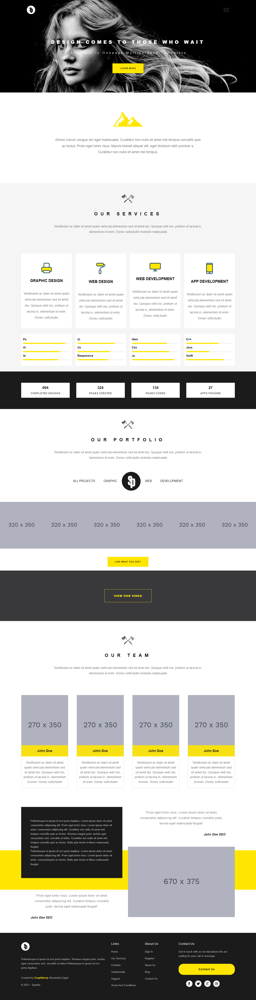

# Sparkle-Template


## Preview
you can see it from here https://mohaned-sparkle-template.netlify.app/

## Overview 

This is another personal project from my series **Slicing PSDs into responsive UIs** projects.

It was practising on (HTML5, CSS3, Pure Responsive concepts).

## Download

1. Clone Project:
    ```
        $ git clone https://github.com/Mohaned-Adel/Sparkle-Temp.git
    ```
2. open it:
    open it with your code editor or open the index.html file.

3. enjoy it: 
    Start Hacking

# Template

<p align="center">
    
</p>